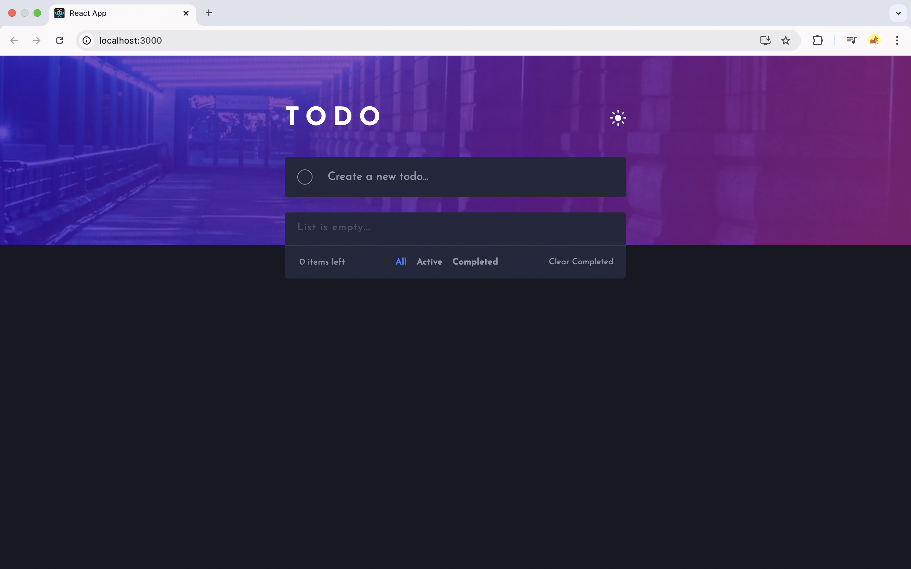
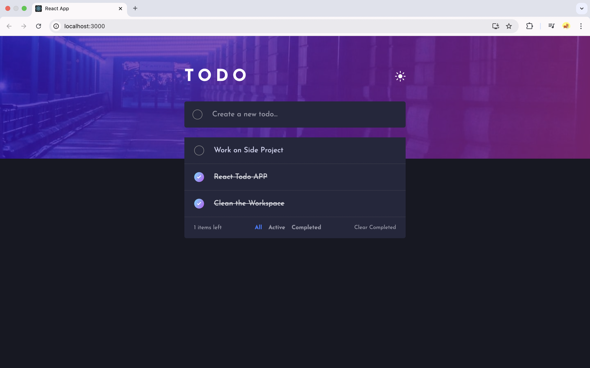

# 📝 Todo App – Built with ReactJS

A simple yet powerful Todo app built using **ReactJS** to help you manage and track your daily tasks efficiently. The app is designed to be lightweight, user-friendly, and capable of saving your tasks even after closing the browser.

## 🚀 Live Demo:
[Click here to view live demo](YOUR_LIVE_DEMO_LINK)

## 📸 Screenshots:
### 🖼️ Screenshot 1:


### 🖼️ Screenshot 2:


## 🛠️ Tech Stack:
- ⚛️ **ReactJS** – For building the user interface.
- 🎨 **SCSS** – For styling and enhancing the design.

## ✨ Key Features:
- ✅ **Persistent Storage:** Tasks are saved locally, so your to-dos remain intact even after closing or refreshing the browser tab.
- ➕ **Add Tasks:** Quickly add tasks with a simple input field.
- ❌ **Delete Tasks:** Easily remove completed or unnecessary tasks.
- 🔀 **Drag&Drop:** Drag and drop todos according to your priority.
- 📱 **Responsive Design:** Optimized to work seamlessly across all devices – desktops, tablets, and smartphones.
- 🧼 **Minimal and Clean UI:** Focused on simplicity for a clutter-free task management experience.

## 📦 Installation and Setup:
**1. Clone the repository:**
   ```bash
   git clone https://github.com/ashish-d2/react-todo-app
   cd todo-app
```

**2. Install Dependencies:**
```bash
npm install
```

**3. Start the development server:**
```bash
npm start
```

